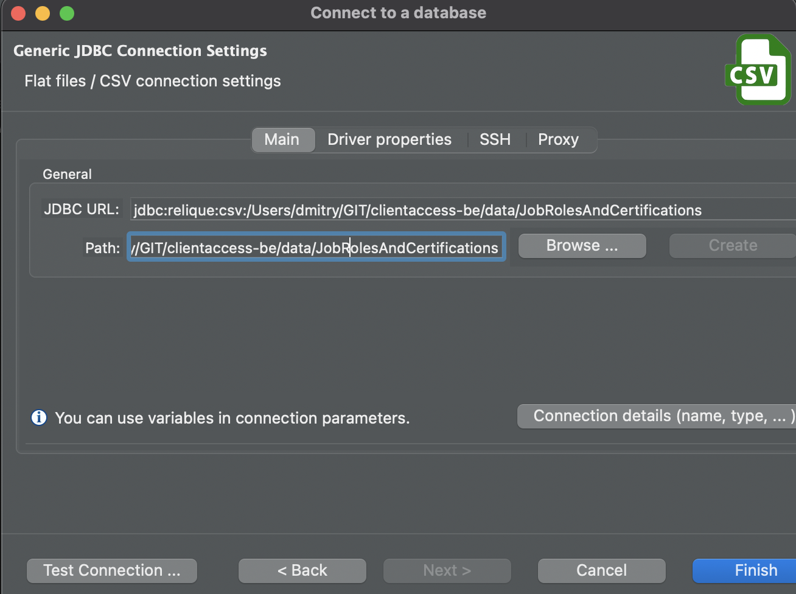
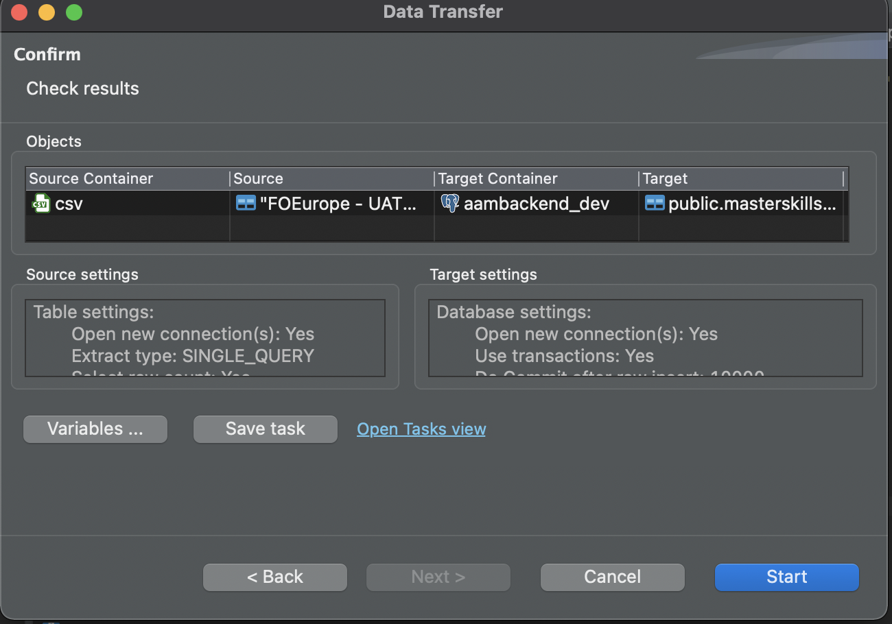

# How to create the data seed for Job Roles and Certifications

### Summary

The following steps are manual for now. In the future we might want to automate seed generation procedure.

### Requirements

1. [Master skill set file](FOEurope%20-%20UAT%20Master%20Skill.csv)
2. Postgresql
3. DBeaver or any other IDE for Postgresql


### Step 1: Import CSV file into temporary table

Add JDBC connection to master skill csv file:



Export data with default data transfer settings.



### Step 2: Generate Job Role data seed for the tenant

Replace placeholders `[[TENANT ID]]`, `[[TENANT COUNTRY CODE]]` and `[[TENANT NAME]]` in the following sql script template and execute the query:
```
select json_agg(json_build_object('id', uuid_generate_v4(), 'tenantId', [[TENANT ID]], 'name', masterSkillName, 'infoSkillCode', skillCode, 'colorId', 0))
from public.masterskillset
where type2 = 'Job_title' and countries like '%[[TENANT COUNTRY CODE]]%' and brands like '%[[TENANT NAME]]%'
```

The script should look like this:
```
select json_agg(json_build_object('id', uuid_generate_v4(), 'tenantId', 110, 'name', masterSkillName, 'infoSkillCode', skillCode, 'colorId', 0))
from public.masterskillset
where type2 = 'Job_title' and countries like '%LU%' and brands like '%Adecco%'
```

Copy & paste the result json onto [the seed file](/src/seed/jobRole.seed.ts)

### Step 3: Generate Certification data seed for the tenant

Replace placeholders `[[TENANT ID]]`, `[[TENANT COUNTRY CODE]]` and `[[TENANT NAME]]` in the following sql script template and execute the query:
```
select json_agg(json_build_object('id', uuid_generate_v4(), 'tenantId', [[TENANT ID]], 'name', masterSkillName, 'infoSkillCode', skillCode))
from public.masterskillset
where type2 = 'Certification' and countries like '%[[TENANT COUNTRY CODE]]%' and brands like '%[[TENANT NAME]]%'
```

The script should look like this:
```
select json_agg(json_build_object('id', uuid_generate_v4(), 'tenantId', 110, 'name', masterSkillName, 'infoSkillCode', skillCode))
from public.masterskillset
where type2 = 'Certification' and countries like '%LU%' and brands like '%Adecco%'
```

Copy & paste the result json onto [the seed file](/src/seed/certification.seed.ts)
