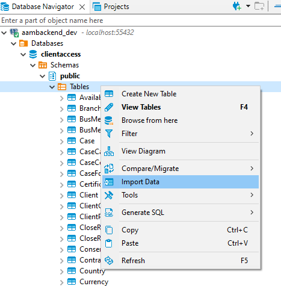
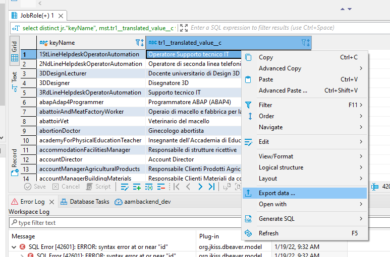
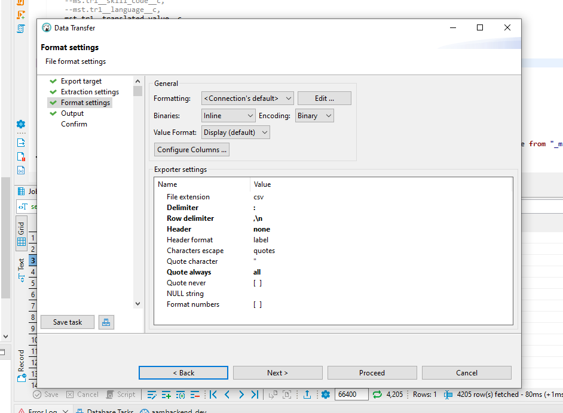

# Extracting Job Role translations

## Instructions

**Prerequisite**: Job Roles are loaded in the DB with `keyName` and `infoSkillCode`.

These instructions are quite a bit manual and are specific for DBeaver. There are probably lots of ways to achieve the same result; this is just one of them!

All table names are suggested. You can use whatever you like.

1. From file `FOEurope - UAT Master Skill.csv`, create a new file with only the header line and those lines that contain the text `Job_Title`. Then import this file into the DB to table `_master_skill`. The default import options should work. (If you decide to load the entire file instead of filtering before, you'll need an extra `where` clause in the query, and importing will take longer, but do as you prefer).


2. Load file `FOEurope - UAT Master Skills Translations.csv` into the DB to table `_master_skill_translations`. Again, default options should just work.
3. Run the following query:

    ```sql
    select distinct
      jr."keyName",
      mst.tr1__translated_value__c
    from "_master_skill" ms
    join "_master_skill_translations" mst on ms."name" = mst.tr1__master_skill__r_name
    join "JobRole" jr on jr."infoSkillCode" = ms.tr1__skill_code__c
    where jr."infoSkillCode" <> '0'
    and mst.tr1__language__c = '[[LANGUAGE CODE]]'
    order by jr."keyName"
    ```

    replacing `[[LANGUAGE CODE]]` with some code in the `TR1__Language__c` column (usually 2-letter codes in caps, but there are some quirks in the source file).

4. Export the result as CSV **with the following format settings**:
    - Delimiter: `:`
    - Row delimiter: `,\n`
    - Header: `none`
    - Quote always: `all`

    
    

   It's best to copy the result to the clipboard in the `Output` section of the exporting wizard and create a new file in your editor of choice, since you'll have to edit it and save it as `.json` instead of `.csv` anyway.

5. Add braces (`{}`) to turn the file into valid json.
6. Store the file in its proper place in the frontend.
7. Repeat steps 3 to 6 for each language required.
8. Commit and push to the frontend project.
9. Optionally, drop the tables `_master_skill` and `_master_skill_translations`.

## Caveats

- You may need to fix some escaped characters in the output; in particular, quotes are escaped with `""` in the csv, but in json, you need to replace them with `\"`. You will realize this in an advanced text editor because it will trigger squiggly red lines!
- As of this writing, the count of distinct `keyName`s in `JobRole` doesn't match the result count. This is due to problems in the source data. This is also why I'm writing this documentation: because we'll need to do this again sometime soon 😀
